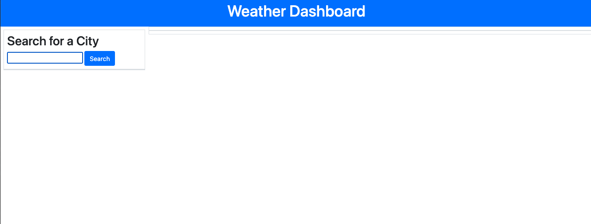
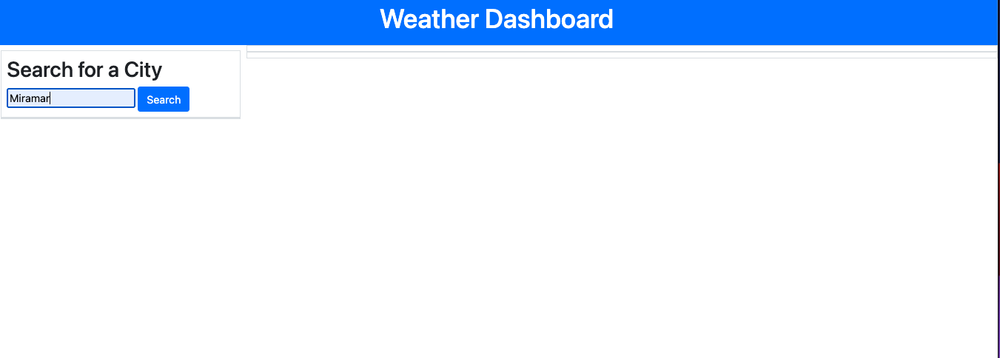
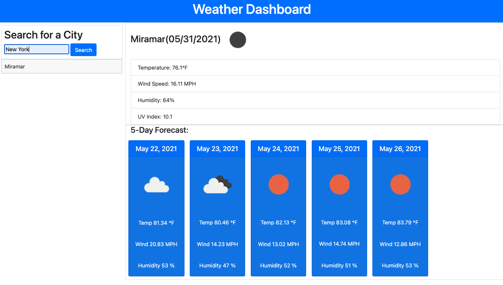
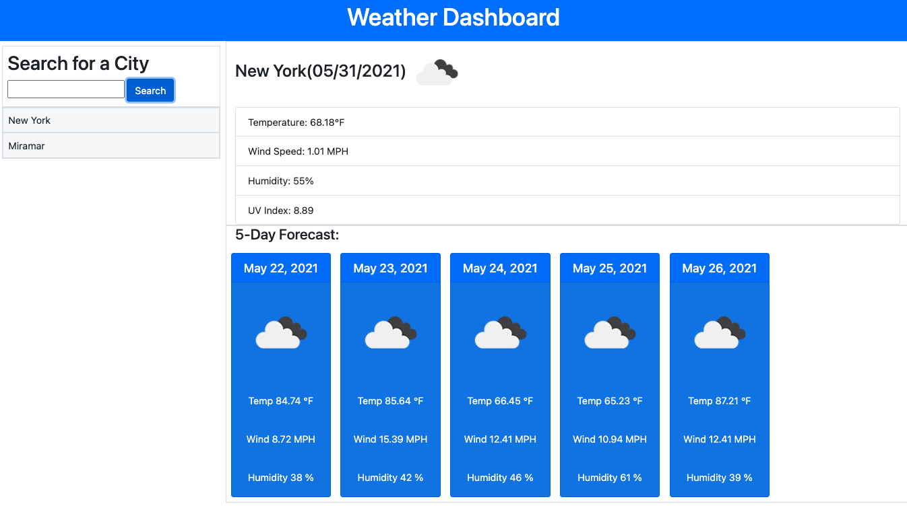
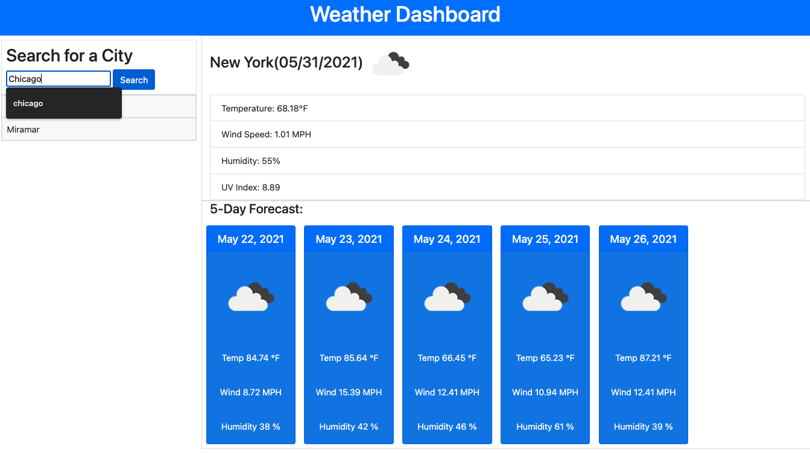
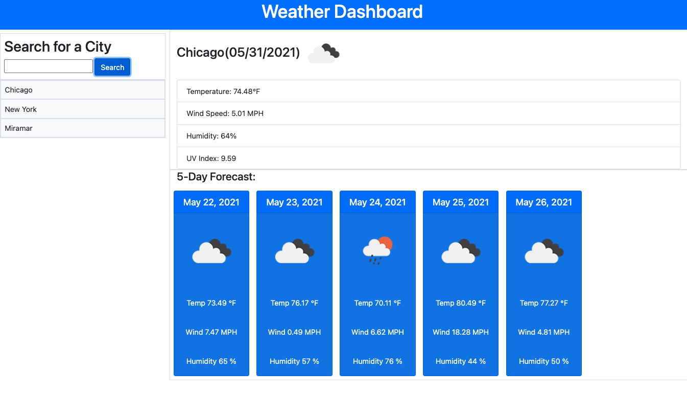

# WeatherDashboard
This weather dashboard route will allow you to see the weather outlook for multiple cities, allowing the user to plan for a trip.  trip accordingly

## Images

## Live link
 https://reebritt.github.io/WeatherDashboard

## websites used
https://openweathermap.org/api/one-call-api#how

https://momentjs.com
